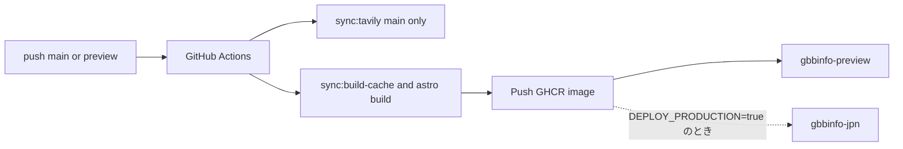

# GBBINFO4.0

gbbinfo3.0 の Flask/Jinja 実装を、Render.com（Docker）上の **Astro 静的サイト（SSG）** へ置き換える実装リポジトリです。

## 技術スタック

- **フレームワーク**: Astro 7（`output: "static"`）
- **UI**: React 19（インタラクティブ部分のみ island として利用）
- **スタイル**: Tailwind CSS 4
- **i18n**: inlang + Paraglide JS（`messages/` → `paraglide/`）
- **DB**: Supabase Postgres + Drizzle ORM
- **本番配信**: nginx（Docker イメージ内で静的ファイルを配信）
- **静的アセット**: Cloudflare Pages（[`cloudflare/`](cloudflare/)）
- **Node.js**: 24.x（`.nvmrc` 参照）

## 実装方針

- 言語状態は URL のみ（`/{lang}/...`）、cookie / session は不使用
- 対応言語: `ja`（デフォルト）, `ko`, `en`, `cs`, `da`, `de`, `es`, `et`, `fr`, `hi`, `hu`, `it`, `ms`, `nl`, `no`, `pl`, `pt`, `ta`, `zh_Hans_CN`, `zh_Hant_TW`（`src/constants/languageLabels.ts` が正）
- ビルド時（SSG）に `sync:build-cache` で Supabase から一括取得したスナップショット（`.cache/build/`）を参照し、全ページを静的 HTML として生成
- 出場者詳細ページは astro build 中に DB へアクセスしない（帯域削減）
- DB アクセスは `src/db/` 層（Drizzle ORM）を経由
- ページは Astro（`.astro`）、本文 UI は React コンポーネント（`src/views/`）に分離

## 主なディレクトリ

| パス | 説明 |
|------|------|
| `src/pages/` | Astro ルート（`[lang]/` プレフィックス、`getStaticPaths` で SSG） |
| `src/views/` | 各ページの React コンテンツコンポーネント |
| `src/components/` | 共通 UI（Astro / React） |
| `src/layouts/` | ページレイアウト（`SiteFrame.astro` など） |
| `src/db/` | DB アクセス層（Drizzle ORM） |
| `src/middleware.ts` | SSG ビルド時の Paraglide ロケール設定 |
| `messages/` | 翻訳 JSON（inlang ソース） |
| `paraglide/` | Paraglide 生成物（編集しない） |
| `shared/` | ページ・スクリプト共通の定数・型 |
| `scripts/` | ロケール同期・Tavily 同期などの補助スクリプト |
| `docs/DATABASE.md` | データベーススキーマ |
| `cloudflare/` | 静的画像アセットと Cloudflare Pages デプロイ設定 |

## 開発コマンド

```bash
# 依存関係のインストール
npm install

# ローカル開発（locales 同期 → build-cache 同期 → astro dev）
npm run dev

# 本番ビルド（locales 同期 → build-cache 同期 → astro build）
npm run build

# ビルド成果物のプレビュー
npm run preview

# 型チェック
npm run typecheck

# 静的アセットのローカル配信（http://127.0.0.1:8788）
npm run assets:dev

# 静的アセットを Cloudflare Pages へ手動デプロイ
npm run assets:deploy
```

### 補助スクリプト

```bash
# languageLabels.ts → project.inlang/settings.json へロケールを同期（dev / build で自動実行）
npm run sync:locales

# Supabase → ビルド用スナップショット（.cache/build/）へ一括ダウンロード（dev / build で自動実行）
npm run sync:build-cache

# Supabase 同期をスキップ（dev で自動付与。既存 .cache/build/ をそのまま利用）
npm run sync:build-cache -- --skip

# Tavily 検索結果を Supabase へ upsert（要 DATABASE_URL, Tavily / DeepL API キー）
npm run sync:tavily

# Supabase Tavily テーブル → ローカルキャッシュ（.cache/tavily/）へダウンロード
npm run sync:tavily:cache
```

## デプロイ（GitHub Actions → GHCR → Render）

ビルド・データ同期は **GitHub Actions** で行い、Render は **prebuilt Docker イメージ（nginx + `dist/`）** を配信するだけです。



| ブランチ | Render サービス | Tavily/DeepL | 備考 |
|----------|-----------------|--------------|------|
| `preview` | `gbbinfo-preview` | 実行しない | 不足データの作成なし |
| `main` | `gbbinfo-jpn` | `sync:tavily` で不足分を作成 | 本番デプロイは repository variable `DEPLOY_PRODUCTION=true` のときのみ |

ワークフロー: [`.github/workflows/deploy-site.yml`](.github/workflows/deploy-site.yml)

### 必要な GitHub Secrets / Variables

**Secrets**

| 名前 | 用途 |
|------|------|
| `DATABASE_URL` | build-cache / tavily |
| `TAVILY_API_KEY` | main の `sync:tavily` |
| `DEEPL_API_KEY` | main の `sync:tavily` |
| `RENDER_API_KEY` | Render Deploy API |

**Variables（任意・既定あり）**

| 名前 | 既定 | 説明 |
|------|------|------|
| `PUBLIC_ASSET_BASE_URL` | `https://gbbinfo-assets.pages.dev` | アセット CDN |
| `PUBLIC_SITE_URL_PREVIEW` | `https://gbbinfo-preview.onrender.com` | preview の canonical |
| `PUBLIC_SITE_URL_PRODUCTION` | `https://gbbinfo-jpn.onrender.com` | 本番の canonical |
| `RENDER_SERVICE_ID_PREVIEW` | `srv-d9fo6qb7uimc73f3gqsg` | preview サービス ID |
| `RENDER_SERVICE_ID_PRODUCTION` | `srv-cpr2q6lumphs73bumjr0` | 本番サービス ID |
| `DEPLOY_PRODUCTION` | （未設定=`false`） | `true` のときのみ main → gbbinfo-jpn デプロイ |

### ローカルでのフル Docker ビルド

本番経路は GHA ですが、ソースから一括ビルドする検証用に [`Dockerfile.full`](Dockerfile.full) があります。通常の [`Dockerfile`](Dockerfile) はビルド済み `dist/` を COPY する runtime 専用です。

```bash
npm run build
docker build -t gbbinfo4.0:local .
```

## 環境変数

| 変数名 | 説明 |
|--------|------|
| `DATABASE_URL` | Supabase Postgres の接続文字列（SSG ビルド時に必須） |
| `DEPLOY_ENV` | 実行環境（`production` / `preview` / `dev`。`production` 以外は title にプレフィックス、`noindex`） |
| `PUBLIC_ASSET_BASE_URL` | Cloudflare Pages の公開 URL（例: `https://gbbinfo-assets.pages.dev`。dev / build とも必須） |
| `PUBLIC_SITE_URL` | （任意）サイト絶対 URL の上書き。未設定時は Render の `RENDER_EXTERNAL_URL`、それも無ければ本番既定 URL |
| `RENDER_EXTERNAL_URL` | Render が自動注入（`https://xxx.onrender.com`）。手設定不要 |
| `TAVILY_API_KEY` | `sync:tavily` 用（本番 GHA / 手動同期） |
| `DEEPL_API_KEY` | `sync:tavily` 用（本番 GHA / 手動同期） |

canonical / OGP / sitemap の絶対 URL はビルド時に確定する。GHA ではブランチごとに `PUBLIC_SITE_URL` を渡す。独自ドメインを正規 URL にしたいときだけ `PUBLIC_SITE_URL_PRODUCTION` 等を上書きする。

`.env.example` を `.env` にコピーし、Supabase Dashboard → Connect → Shared Pooler → Transaction mode の URI と Cloudflare Pages URL を設定してください。画像の追加・更新は [`cloudflare/README.md`](cloudflare/README.md) を参照。
