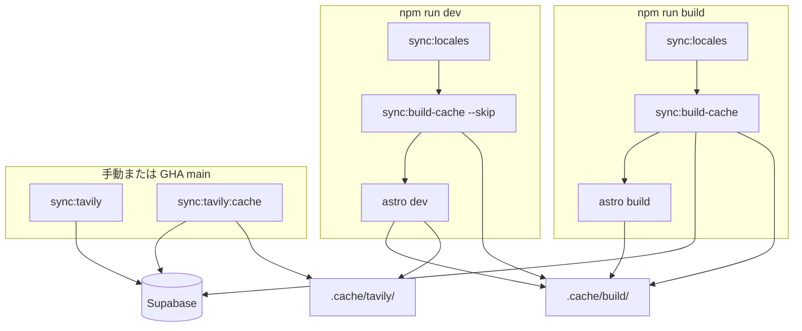

# ビルド・同期コマンドの使い分け

`package.json` の `sync:*` / `dev` / `build` が何をするか、いつ手動実行するかをまとめる。

## 全体像



| コマンド | Supabase 接続 | 主な出力先 | dev / build で自動実行 |
|---|---|---|---|
| `sync:locales` | なし | `project.inlang/settings.json` | 両方 |
| `sync:build-cache` | あり（4 bulk SELECT） | `.cache/build/` | build のみ（dev は `--skip`） |
| `sync:tavily` | あり（upsert） | Supabase `Tavily` テーブル | **GHA（main）のみ自動**。ローカルは手動 |
| `sync:tavily:cache` | あり（読み取り） | `.cache/tavily/` | なし |
| `dev` | 上記に依存 | — | — |
| `build` | 上記に依存 | `dist/` | ローカル / GHA |

---

## `sync:locales`

`src/constants/languageLabels.ts` の対応言語を `project.inlang/settings.json` に書き込む。

- **目的**: Paraglide のロケール設定をコード側の正と一致させる
- **DB**: 不要
- **いつ実行するか**: 通常は `dev` / `build` が自動実行する。`languageLabels.ts` を編集した直後に単体実行してもよい
- **帯域**: ファイル書き込みのみ

```bash
npm run sync:locales
```

---

## `sync:build-cache`

Supabase から SSG 用データを **一括取得** し、`.cache/build/snapshot.json` に保存する。

取得対象（4 並列 bulk SELECT）:

- `Year` + `Country`
- `Participant`（関連込み）
- `ParticipantMember`（関連込み）
- `Tavily`

`astro build` はこのスナップショットを参照し、出場者詳細ページ生成中は DB にアクセスしない。

### オプション

| フラグ | 動作 |
|---|---|
| （なし） | 常に Supabase から再取得 |
| `--skip` | 同期しない（既存キャッシュをそのまま使う） |
| `--skip-if-fresh` | manifest のバージョンが一致していればスキップ |
| `--force` | `--skip` / `--skip-if-fresh` を無視して再取得 |

```bash
# 本番ビルド相当（build から自動実行）
npm run sync:build-cache

# 開発用（dev から自動実行。データが古くてもよい前提）
npm run sync:build-cache -- --skip

# 手動で最新 DB 反映したいとき
npm run sync:build-cache
```

- **必要な環境変数**: `DATABASE_URL`（`--skip` 時は不要）
- **キャッシュ場所**: `.cache/build/`（gitignore 済み）
- **初回 dev**: キャッシュが無い場合、出場者詳細などは DB フォールバックまたは `sync:build-cache` の手動実行が必要

---

## `sync:tavily`

出場者名ごとに Tavily API で検索し、DeepL で翻訳した結果を Supabase `Tavily` テーブルへ upsert する。

- **目的**: 本番データの Tavily 検索結果・answer 翻訳を更新する（不足分のみ。`--force` で再取得）
- **いつ実行するか**:
  - **本番デプロイ（`main` の GHA）で自動実行**
  - ローカルでは新規出場者追加後など **手動**
- **`preview` ブランチの GHA / `astro build` 単体には含まれない**
- **必要な環境変数**: `DATABASE_URL`, `TAVILY_API_KEY`, `DEEPL_API_KEY`

```bash
npm run sync:tavily
npm run sync:tavily -- --force   # 既存 answer があっても再取得
```

---

## `sync:tavily:cache`

Supabase `Tavily` テーブルから `.cache/tavily/{cache_key}.json` へダウンロードする。

- **目的**: **開発時**の出場者詳細ページで Tavily 表示を DB なしで行う
- **参照タイミング**: `astro dev` 中、`findTavilyDataForPage` がローカルキャッシュを優先
- **本番ビルド**: `sync:build-cache` のスナップショットに Tavily が含まれるため、通常は不要
- **必要な環境変数**: `DATABASE_URL`

```bash
npm run sync:tavily:cache
npm run sync:tavily:cache -- --force
```

Tavily データ更新の典型フロー:

1. `npm run sync:tavily` — Supabase を更新
2. `npm run sync:tavily:cache` — ローカル dev 用キャッシュを更新（dev で Tavily を見る場合）
3. `npm run sync:build-cache` — 本番ビルド用スナップショットを更新

---

## `dev`

```bash
npm run dev
```

内部で順に実行:

1. `sync:locales`
2. `sync:build-cache -- --skip` — Supabase に触れず、既存 `.cache/build/` を利用
3. `astro dev`

開発中は DB 帯域を消費しない設計。Participant 等の表示データが古い場合は `npm run sync:build-cache` を手動実行する。

---

## `build`

```bash
npm run build
```

内部で順に実行:

1. `sync:locales`
2. `sync:build-cache` — Supabase から最新スナップショットを取得
3. `astro build` — 静的 HTML を `dist/` に生成

Render 本番経路では、GHA が `sync:locales` →（main のみ `sync:tavily`）→ `sync:build-cache` → `astro build` → Docker イメージ push → Render デプロイを行う。Render 上ではソースビルドしない（runtime イメージの nginx 配信のみ）。詳細は [README.md](../README.md) のデプロイ節を参照。

---

## よくある場面

| やりたいこと | 実行するコマンド |
|---|---|
| 通常のローカル開発 | `npm run dev` |
| DB の最新出場者を dev で見たい | `npm run sync:build-cache` → `npm run dev` |
| 本番デプロイ前の確認 | `npm run build` |
| 言語を追加した | `languageLabels.ts` 編集 → `npm run dev` または `npm run build`（locales 同期は自動） |
| Tavily 表示を dev で確認したい | `sync:tavily:cache`（必要なら先に `sync:tavily`） |
| Tavily 本番データを更新したい | `main` へ push（GHA が `sync:tavily`）または手動 `sync:tavily` |
| preview を更新したい | `preview` へ push |
| 本番 Render デプロイを有効化 | GitHub variable `DEPLOY_PRODUCTION=true`（合図後） |

---

## 関連ドキュメント

- [README.md](../README.md) — 環境変数・デプロイ手順
- [DATABASE.md](./DATABASE.md) — スキーマ定義
