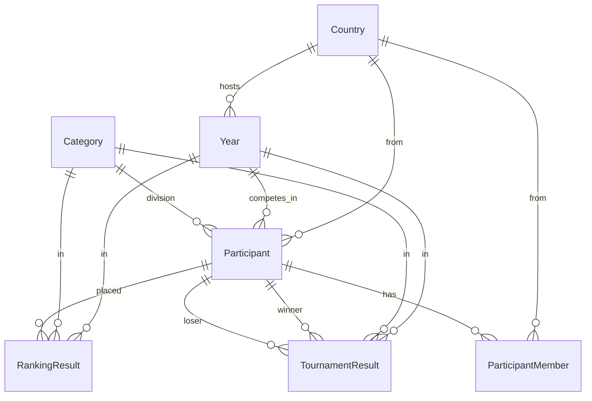

# データベーススキーマ概要（public）

このドキュメントは **AI・人間が素早く把握するための要約** です。DDL の完全版（`pg_dump` 形式）は `docs/schema.sql` を参照してください。

- **DBMS**: PostgreSQL（ダンプ由来のメタデータでは 17.x / pg_dump 18.x 表記）
- **スキーマ**: `public`
- **命名**: テーブル名は PascalCase で **ダブルクォート付き**（例: `"Participant"`）。アプリやクエリではそのまま引用が必要です。

---

## 1. ドメインの読み方（一言）

大会・イベント系のデータを想定しています。**年度（Year）**、**国（Country）**、**部門（Category）** を軸に、**出場者＝チーム単位（Participant）** と **メンバー（ParticipantMember）**、**ランキング結果（RankingResult）**、**トーナメント対戦結果（TournamentResult）** を保持します。加えて **Tavily** は外部検索 API のキャッシュ用テーブルです。

---

## 2. エンティティ関係（概念図）

外部キーはすべて `ON DELETE CASCADE` です（親を消すと子が連鎖削除）。

---

## 3. テーブル一覧

### 3.1 `Category`（部門）

| カラム | 型 | NULL | 既定 | 説明 |
|--------|-----|------|------|------|
| `id` | `integer` | NOT NULL | IDENTITY | 主キー |
| `name` | `varchar` | NOT NULL | — | 部門名（`UNIQUE`） |
| `is_team` | `boolean` | NOT NULL | `false` | チーム部門かどうか |

- **PK**: `Category_pkey` (`id`)
- **UK**: `Category_name_key` (`name`)

---

### 3.2 `Country`（各国の基本情報）

| カラム | 型 | NULL | 既定 | 説明 |
|--------|-----|------|------|------|
| `iso_code` | `integer` | NOT NULL | — | 主キー（数値の国コード） |
| `latitude` | `numeric` | NOT NULL | `0` | 緯度 |
| `longitude` | `numeric` | NOT NULL | `0` | 経度 |
| `names` | `jsonb` | NOT NULL | — | 名称など（`UNIQUE`） |
| `en_name` | `text` | YES | — | 英名 |
| `ja_name` | `text` | YES | — | 和名 |
| `iso_alpha2` | `text` | YES | — | 2 文字以内（`CHECK (length(iso_alpha2) <= 2)`） |

- **PK**: `Country_pkey` (`iso_code`)
- **UK**: `Country_iso_code_key`（`iso_code`）、`Country_names_key`（`names`）

---

### 3.3 `Year`（年度と開催日）

| カラム | 型 | NULL | 既定 | 説明 |
|--------|-----|------|------|------|
| `year` | `integer` | NOT NULL | — | 主キーかつ `UNIQUE`（年度） |
| `starts_at` | `timestamptz` | YES | — | 開始 |
| `ends_at` | `timestamptz` | YES | — | 終了 |
| `categories` | `integer[]` | YES | — | 部門 ID の配列（`Category.id` を想定） |
| `city` | `text` | YES | — | 開催都市 |
| `iso_code` | `integer` | YES | — | FK → `Country.iso_code` |

- **PK**: `Year_pkey` (`year`)
- **UK**: `Year_year_key` (`year`) ※実質 PK と重複
- **FK**: `Year_iso_code_fkey` → `Country(iso_code)` CASCADE

---

### 3.4 `Participant`（出場者・チーム単位）

| カラム | 型 | NULL | 既定 | 説明 |
|--------|-----|------|------|------|
| `id` | `integer` | NOT NULL | IDENTITY | 主キー |
| `name` | `varchar` | NOT NULL | — | 表示名 |
| `year` | `integer` | NOT NULL | — | FK → `Year.year` |
| `iso_code` | `integer` | NOT NULL | — | FK → `Country.iso_code` |
| `is_cancelled` | `boolean` | NOT NULL | `false` | 取消フラグ |
| `category` | `integer` | NOT NULL | — | FK → `Category.id` |
| `ticket_class` | `varchar` | NOT NULL | — | チケット区分など |

- **PK**: `Participant_pkey` (`id`)
- **FK**:
  - `Participant_year_fkey` → `Year(year)` CASCADE
  - `Participant_iso_code_fkey` → `Country(iso_code)` CASCADE
  - `Participant_category_fkey` → `Category(id)` CASCADE

---

### 3.5 `ParticipantMember`（チームの個別メンバー）

| カラム | 型 | NULL | 既定 | 説明 |
|--------|-----|------|------|------|
| `id` | `bigint` | NOT NULL | IDENTITY | 主キー |
| `participant` | `integer` | NOT NULL | — | FK → `Participant.id` |
| `name` | `varchar` | NOT NULL | — | メンバー名 |
| `iso_code` | `integer` | NOT NULL | — | FK → `Country.iso_code` |

- **PK**: `ParticipantMember_pkey` (`id`)
- **FK**:
  - `ParticipantMember_participant_fkey` → `Participant(id)` CASCADE
  - `ParticipantMember_iso_code_fkey` → `Country(iso_code)` CASCADE

---

### 3.6 `RankingResult`（ランキング形式部門の結果）

| カラム | 型 | NULL | 既定 | 説明 |
|--------|-----|------|------|------|
| `id` | `bigint` | NOT NULL | IDENTITY | 主キー |
| `year` | `integer` | NOT NULL | — | FK → `Year.year` |
| `category` | `integer` | NOT NULL | — | FK → `Category.id` |
| `round` | `varchar` | YES | — | ラウンド名（任意） |
| `participant` | `integer` | NOT NULL | — | FK → `Participant.id` |
| `rank` | `integer` | NOT NULL | — | 順位 |

- **PK**: `RankingResult_pkey` (`id`)
- **FK**:
  - `RankingResult_year_fkey` → `Year(year)` CASCADE
  - `RankingResult_category_fkey` → `Category(id)` CASCADE
  - `RankingResult_participant_fkey` → `Participant(id)` CASCADE

---

### 3.7 `TournamentResult`（トーナメントの結果）

| カラム | 型 | NULL | 既定 | 説明 |
|--------|-----|------|------|------|
| `id` | `integer` | NOT NULL | IDENTITY | 主キー |
| `year` | `integer` | NOT NULL | — | FK → `Year.year` |
| `category` | `integer` | NOT NULL | — | FK → `Category.id` |
| `round` | `varchar` | NOT NULL | — | ラウンド名 |
| `winner` | `integer` | NOT NULL | — | FK → `Participant.id` |
| `loser` | `integer` | NOT NULL | — | FK → `Participant.id` |

- **PK**: `TournamentResult_pkey` (`id`)
- **FK**:
  - `TournamentResult_year_fkey` → `Year(year)` CASCADE
  - `TournamentResult_category_fkey` → `Category(id)` CASCADE
  - `TournamentResult_winner_fkey` → `Participant(id)` CASCADE
  - `TournamentResult_loser_fkey` → `Participant(id)` CASCADE

---

### 3.8 `Tavily`（検索キャッシュ）

| カラム | 型 | NULL | 既定 | 説明 |
|--------|-----|------|------|------|
| `id` | `integer` | NOT NULL | IDENTITY | 主キー |
| `cache_key` | `text` | NOT NULL | — | キャッシュキー（`UNIQUE`） |
| `search_results` | `jsonb` | NOT NULL | — | 検索結果ペイロード |
| `created_at` | `timestamptz` | NOT NULL | `now()` | 作成日時（古い行削除の基準） |
| `answer_translation` | `jsonb` | NOT NULL | `{}` | 翻訳などの付帯 JSON |

- **PK**: `Tavily_pkey` (`id`)
- **UK**: `Tavily_name_key`（実体は `cache_key` に UNIQUE。制約名は歴史的なもの）

---

## 4. 関数（public）

| 名前 | 戻り値 | ざっくりした挙動 |
|------|--------|------------------|
| `delete_old_tavily_records()` | `integer` | `Tavily` で `created_at` が 1 ヶ月より古い行を削除し、削除件数を返す |
| `delete_oldest_tavily_record()` | `integer` | `created_at` が最も古い 1 行を削除（サブクエリで `id` を特定）。戻り値は `ROW_COUNT` |
| `delete_oldest_tavily_records()` | `integer` | 上に近いが本体が 1 行に潰れた定義（ダンプ上 `$$DECLARE` 連結）。挙動は「最古 1 件削除」系 |

**注意**: `delete_oldest_tavily_record` と `delete_oldest_tavily_records` は名前が紛らわしいので、利用側ではどちらを呼ぶか統一した方が安全です。

---

## 5. 行レベルセキュリティ（RLS）

次のテーブルで **RLS が有効** です。

- `Category`, `Country`, `Participant`, `ParticipantMember`, `RankingResult`, `Tavily`, `TournamentResult`, `Year`

**ポリシー**（各テーブル共通の名前）:

- `"Enable read access for all users"`: `FOR SELECT USING (true)` — 誰でも `SELECT` 可

INSERT / UPDATE / DELETE 用のポリシーはこのダンプ断片には含まれていません。運用ロールやサービスロールでどう書き込むかは別途確認してください。

---

## 6. AI がクエリを書くときのヒント

1. **引用**: テーブル名は `"Participant"` のように必ずダブルクォート。
2. **JOIN の軸**: 年度は `Participant.year = "Year".year`、部門は `Participant.category = "Category".id`。
3. **カスケード**: 親レコード削除で子が消える設計。マイグレーションやシード削除の順序に注意。
4. **`Year.categories`**: `integer[]` で参照整合性は DB 上は張られていない（アプリ側で `Category.id` と整合させる前提）。

---

## 7. `docs/schema.sql` との役割分担

| ファイル | 用途 |
|----------|------|
| `docs/schema.sql` | 実 DDL・制約・ポリシー・関数の **完全な再現用**（pg_dump） |
| `docs/schema.md`（本書） | 構造の **要約・検索・説明**（AI のコンテキスト向け） |

スキーマを変更したら、`schema.sql` を更新したうえで、本書の該当セクション（テーブル定義・FK・RLS・関数）も同期してください。
